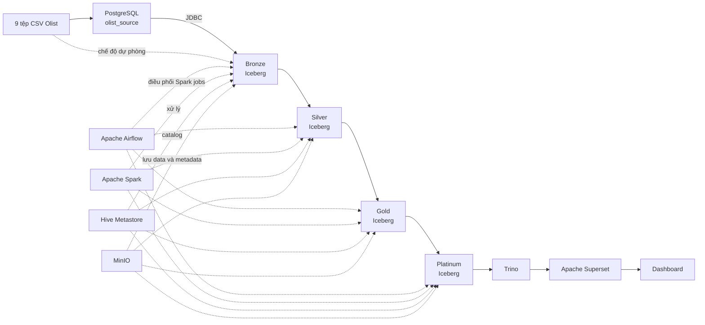
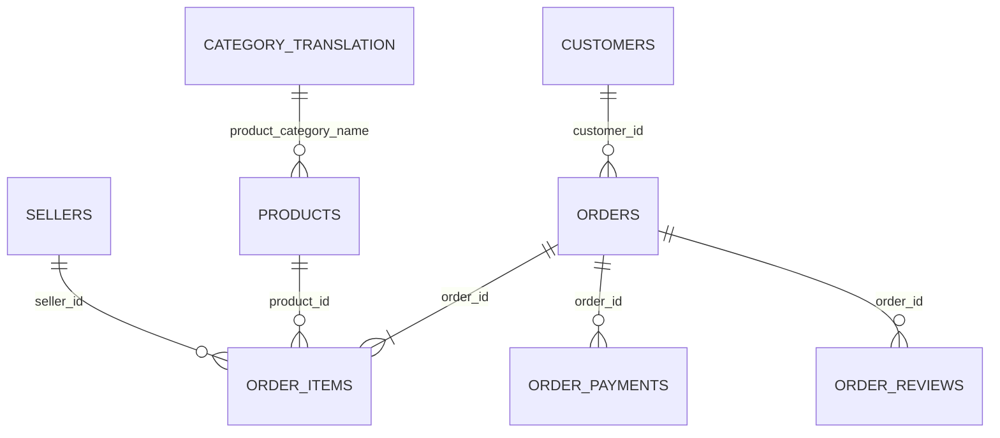
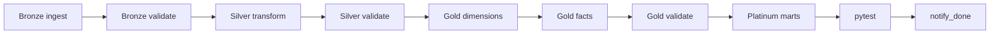

# TÀI LIỆU MÔ TẢ CHI TIẾT DỰ ÁN OLIST MINI LAKEHOUSE

## Mục lục

1. [Tổng quan dự án](#1-tổng-quan-dự-án)
2. [Bài toán và mục tiêu](#2-bài-toán-và-mục-tiêu)
3. [Kiến trúc tổng thể](#3-kiến-trúc-tổng-thể)
4. [Vai trò của từng công nghệ](#4-vai-trò-của-từng-công-nghệ)
5. [Bộ dữ liệu Olist](#5-bộ-dữ-liệu-olist)
6. [Cấu trúc mã nguồn](#6-cấu-trúc-mã-nguồn)
7. [Hạ tầng Docker Compose](#7-hạ-tầng-docker-compose)
8. [Các DAG trong Apache Airflow](#8-các-dag-trong-apache-airflow)
9. [Tầng Bronze](#9-tầng-bronze)
10. [Tầng Silver](#10-tầng-silver)
11. [Tầng Gold](#11-tầng-gold)
12. [Tầng Platinum](#12-tầng-platinum)
13. [Cơ chế incremental, CDC mô phỏng và idempotency](#13-cơ-chế-incremental-cdc-mô-phỏng-và-idempotency)
14. [Apache Iceberg trong dự án](#14-apache-iceberg-trong-dự-án)
15. [Kiểm soát chất lượng dữ liệu](#15-kiểm-soát-chất-lượng-dữ-liệu)
16. [Kiểm thử tự động bằng pytest](#16-kiểm-thử-tự-động-bằng-pytest)
17. [Quan sát và giám sát pipeline](#17-quan-sát-và-giám-sát-pipeline)
18. [Truy vấn và trực quan hóa dữ liệu](#18-truy-vấn-và-trực-quan-hóa-dữ-liệu)
19. [Các kịch bản chạy dự án](#19-các-kịch-bản-chạy-dự-án)
20. [Luồng dữ liệu của một đơn hàng](#20-luồng-dữ-liệu-của-một-đơn-hàng)
21. [Kết quả và giá trị của dự án](#21-kết-quả-và-giá-trị-của-dự-án)
22. [Điểm mạnh, giới hạn và hướng phát triển](#22-điểm-mạnh-giới-hạn-và-hướng-phát-triển)
23. [Các ý chính khi bảo vệ đồ án](#23-các-ý-chính-khi-bảo-vệ-đồ-án)

---

## 1. Tổng quan dự án

**Olist Mini Lakehouse** là một nền tảng dữ liệu thu nhỏ nhưng có đầy đủ các thành phần chính của một hệ thống dữ liệu hiện đại. Dự án tiếp nhận dữ liệu thương mại điện tử Olist, đưa dữ liệu qua nhiều tầng xử lý, kiểm tra chất lượng, xây dựng mô hình phân tích và cung cấp dữ liệu cho dashboard.

Luồng tổng quát của hệ thống:

```text
CSV Olist
   ↓
PostgreSQL mô phỏng hệ thống nguồn OLTP
   ↓
Bronze: dữ liệu thô và lịch sử
   ↓
Silver: dữ liệu sạch, chuẩn hóa, khử trùng lặp
   ↓
Gold: mô hình sao gồm dimension và fact
   ↓
Platinum: các data mart tổng hợp theo nghiệp vụ
   ↓
Trino → Apache Superset → Dashboard
```

Toàn bộ dữ liệu từ Bronze đến Platinum được lưu dưới dạng bảng **Apache Iceberg** trên **MinIO**. **Apache Spark** thực hiện xử lý dữ liệu, **Apache Airflow** điều phối công việc, **Hive Metastore** quản lý catalog, **Trino** cung cấp lớp truy vấn SQL và **Apache Superset** hiển thị dashboard.

Dự án được đóng gói bằng Docker Compose nên có thể chạy đồng nhất trên máy cá nhân hoặc máy chủ đám mây.

---

## 2. Bài toán và mục tiêu

### 2.1. Bài toán nghiệp vụ

Bộ dữ liệu Olist chứa thông tin về:

- Đơn hàng và trạng thái xử lý đơn hàng.
- Khách hàng và vị trí địa lý.
- Sản phẩm và danh mục sản phẩm.
- Người bán.
- Các mặt hàng trong từng đơn.
- Thanh toán.
- Đánh giá của khách hàng.
- Thời gian mua hàng, giao hàng và thời gian giao dự kiến.

Từ dữ liệu này, hệ thống cần trả lời các câu hỏi như:

- Doanh thu và số đơn thay đổi thế nào theo tháng?
- Bang nào có nhiều đơn hàng và doanh thu cao nhất?
- Danh mục sản phẩm nào bán tốt nhất?
- Thời gian giao hàng trung bình là bao nhiêu?
- Tỷ lệ giao hàng trễ là bao nhiêu?
- Phương thức thanh toán nào được sử dụng nhiều nhất?
- Danh mục nào nhận được đánh giá tốt?
- Bao nhiêu khách hàng quay lại mua từ lần thứ hai?

### 2.2. Mục tiêu kỹ thuật

Dự án không chỉ tạo dashboard mà còn chứng minh một quy trình dữ liệu hoàn chỉnh:

1. Mô phỏng dữ liệu nguồn dạng OLTP bằng PostgreSQL.
2. Xây dựng kiến trúc Lakehouse theo mô hình Medallion.
3. Nạp dữ liệu tăng dần bằng watermark.
4. Mô phỏng thay đổi vòng đời đơn hàng theo kiểu CDC.
5. Lưu lịch sử dữ liệu bằng snapshot của Iceberg.
6. Hỗ trợ time travel và `MERGE INTO`.
7. Kiểm soát chất lượng sau từng tầng.
8. Tổ chức mô hình sao phục vụ phân tích.
9. Tạo data mart có định nghĩa nghiệp vụ nhất quán.
10. Điều phối, kiểm thử và theo dõi toàn bộ pipeline.

---

## 3. Kiến trúc tổng thể




### 3.1. Vì sao đây là Lakehouse?

Lakehouse kết hợp hai nhóm ưu điểm:

| Data Lake | Data Warehouse |
|---|---|
| Lưu dữ liệu trên object storage với chi phí thấp | Có schema và bảng rõ ràng |
| Dễ mở rộng dung lượng | Hỗ trợ SQL và mô hình phân tích |
| Có thể giữ dữ liệu thô | Có giao dịch ACID và quản lý phiên bản |

Trong dự án:

- **MinIO** đóng vai trò object storage giống Amazon S3.
- **Iceberg** biến các tệp dữ liệu trên MinIO thành bảng có snapshot, schema và transaction.
- **Spark** ghi và biến đổi bảng Iceberg.
- **Trino** đọc các bảng đó bằng SQL.

### 3.2. Vì sao dùng mô hình Medallion?

Mỗi tầng có một trách nhiệm riêng:

| Tầng | Trách nhiệm | Mức độ xử lý |
|---|---|---|
| Bronze | Giữ dữ liệu gần nguồn và metadata ingest | Ít biến đổi nhất |
| Silver | Chuẩn hóa và làm sạch | Kỹ thuật dữ liệu |
| Gold | Mô hình hóa theo nghiệp vụ | Dimension và fact |
| Platinum | Tổng hợp cho từng nhu cầu báo cáo | Data mart sẵn sàng sử dụng |

Cách phân tầng này giúp dễ truy vết lỗi. Nếu dashboard sai, có thể kiểm tra ngược từ Platinum về Gold, Silver, Bronze và cuối cùng là nguồn PostgreSQL.

---

## 4. Vai trò của từng công nghệ

### 4.1. PostgreSQL 14

PostgreSQL có hai vai trò:

1. Là cơ sở dữ liệu backend dùng chung cho Airflow, Hive Metastore và Superset.
2. Chứa cơ sở dữ liệu `olist_source`, mô phỏng hệ thống giao dịch nguồn.

Các bảng nguồn được tạo bằng DDL rõ ràng, có kiểu dữ liệu và khóa chính. Cách này gần với hệ thống OLTP thực tế hơn việc chỉ đọc trực tiếp CSV.

### 4.2. MinIO

MinIO cung cấp API tương thích S3. Dự án tạo các bucket:

- `raw`
- `bronze`
- `silver`
- `gold`
- `platinum`
- `warehouse`
- `meta`

Iceberg warehouse chính được cấu hình tại `s3a://warehouse/`.

Warehouse này vẫn tồn tại như fallback/catalog warehouse, nhưng implementation
hiện tại đã pin vị trí vật lý của bảng theo từng tầng:

| Namespace | Vị trí bảng Iceberg |
|---|---|
| `bronze.*` | `s3a://bronze/<table>` |
| `silver.*` | `s3a://silver/<table>` |
| `gold.*` | `s3a://gold/<table>` |
| `platinum.*` | `s3a://platinum/<table>` |
| `meta.*` | `s3a://meta/<table>` |

Mapping nằm trong `pipeline/common/config.py` qua `DATABASE_LOCATIONS`. Khi tạo
hoặc replace bảng, code dùng helper `pipeline/common/iceberg.py` để phát lệnh
`CREATE OR REPLACE TABLE ... LOCATION ... AS SELECT ...`. Cách này cần thiết vì
với Hive Metastore hiện tại, `CREATE DATABASE ... LOCATION` chỉ đáng tin cho
namespace tạo mới; database đã tồn tại không thể đổi location bằng
`ALTER DATABASE ... SET LOCATION`.

Bucket `raw` chỉ được sử dụng khi chạy script upload tùy chọn. Pipeline mặc định
đọc CSV từ volume `/opt/dataset`, seed vào PostgreSQL, rồi Bronze đọc PostgreSQL
qua JDBC.

### 4.3. Apache Iceberg 1.5.2

Iceberg là table format, không phải database server. Nó quản lý:

- Schema của bảng.
- Danh sách data file.
- Snapshot sau mỗi lần ghi.
- Lịch sử phiên bản.
- Metadata phục vụ truy vấn.
- Các thao tác ACID như append, overwrite, delete và merge.

### 4.4. Apache Spark 3.5.1

Spark thực hiện các bước ETL/ELT từ Bronze đến Platinum. Dự án có một Spark master và một Spark worker. Airflow chạy `spark-submit`, driver nằm trong container scheduler và job được thực thi trên Spark standalone cluster.

### 4.5. Hive Metastore

Hive Metastore là catalog trung tâm. Nó lưu thông tin namespace và bảng để Spark và Trino cùng nhìn thấy một hệ thống bảng Iceberg thống nhất.

### 4.6. Apache Airflow 2.9.3

Airflow:

- Định nghĩa thứ tự chạy các job.
- Nhóm task theo tầng Medallion.
- Retry khi task thất bại.
- Giới hạn thời gian chạy.
- Ghi log và hiển thị trạng thái DAG.
- Dừng pipeline nếu DQ gate hoặc pytest thất bại.

### 4.7. Trino 440

Trino là query engine phân tán. Trino đọc catalog Iceberg và cung cấp SQL cho người dùng hoặc Superset mà không cần đưa dữ liệu sang một data warehouse khác.

### 4.8. Apache Superset 3.1.3

Superset kết nối Trino, đọc các bảng Platinum và metadata quan sát để xây dựng dashboard nghiệp vụ và dashboard vận hành.

---

## 5. Bộ dữ liệu Olist

Dự án sử dụng chín tệp CSV:

| Tệp nguồn | Bảng nguồn | Grain và nội dung |
|---|---|---|
| `olist_orders_dataset.csv` | `orders` | Một dòng cho một đơn hàng |
| `olist_order_items_dataset.csv` | `order_items` | Một dòng cho một mặt hàng trong đơn |
| `olist_customers_dataset.csv` | `customers` | Một dòng cho một `customer_id` |
| `olist_products_dataset.csv` | `products` | Một dòng cho một sản phẩm |
| `olist_sellers_dataset.csv` | `sellers` | Một dòng cho một người bán |
| `olist_order_payments_dataset.csv` | `order_payments` | Một dòng cho một lần/thành phần thanh toán của đơn |
| `olist_order_reviews_dataset.csv` | `order_reviews` | Một dòng đánh giá gắn với đơn hàng |
| `olist_geolocation_dataset.csv` | `geolocation` | Tọa độ, thành phố và bang theo mã bưu chính |
| `product_category_name_translation.csv` | `category_translation` | Dịch tên danh mục từ tiếng Bồ Đào Nha sang tiếng Anh |

### 5.1. Quan hệ chính



### 5.2. Khóa chính tại nguồn mô phỏng

| Bảng | Khóa chính |
|---|---|
| `orders` | `order_id` |
| `order_items` | `order_id`, `order_item_id` |
| `customers` | `customer_id` |
| `products` | `product_id` |
| `sellers` | `seller_id` |
| `order_payments` | `order_id`, `payment_sequential` |
| `order_reviews` | `review_id`, `order_id` |
| `category_translation` | `product_category_name` |
| `geolocation` | `geolocation_id` tự tăng |

`geolocation` không dùng mã bưu chính làm khóa chính tại PostgreSQL vì một mã có thể xuất hiện nhiều lần trong dữ liệu thô.

---

## 6. Cấu trúc mã nguồn

```text
Mini_LakeHouse/
├── dags/                         # Định nghĩa ba Airflow DAG
├── pipeline/
│   ├── admin/                    # Job vận hành một lần như migrate Iceberg location
│   ├── common/                   # Spark session, config, DQ, job log
│   ├── bronze/                   # Seed nguồn, replay, ingest, validate
│   ├── silver/                   # Làm sạch và validate
│   ├── gold/                     # Xây dimensions, facts và validate
│   └── platinum/                 # Xây bảy data mart
├── tests/                        # Pytest cho Bronze, Silver và Gold
├── docker/                       # Dockerfile và cấu hình từng dịch vụ
├── scripts/                      # Khởi tạo bucket, upload raw, SQL demo Iceberg
├── docs/                         # Tài liệu demo Iceberg
├── notebooks/                    # EDA và hình biểu đồ
├── images/                       # Hình kiến trúc và dashboard
├── app/                          # Placeholder cho ứng dụng/API tương lai
├── mlflow/                       # Placeholder cho phần MLflow tương lai
├── docker-compose.yml            # Khai báo toàn bộ hạ tầng
├── .env.example                  # Biến môi trường mẫu
└── README.md                     # Giới thiệu nhanh dự án
```

### 6.1. Nhóm `pipeline/common`

- `config.py`: ánh xạ CSV, tên bảng, khóa chính, watermark, PostgreSQL và
  mapping namespace sang bucket vật lý.
- `iceberg.py`: helper tạo/replace bảng Iceberg với `LOCATION` đúng bucket tầng.
- `spark_session.py`: tạo SparkSession có Iceberg extension và tạo các namespace.
- `data_quality.py`: khung kiểm tra chất lượng tự viết.
- `job_log.py`: ghi trạng thái, thời lượng và số dòng của từng Spark job.

### 6.2. Nhóm `pipeline/admin`

- `migrate_iceberg_layer_locations.py`: job vận hành để rewrite các bảng Iceberg
  đã tạo sai dưới `warehouse` sang bucket đúng theo layer. Job này đọc current
  snapshot, ghi lại bảng vào location mới, kiểm tra row count và đổi tên bảng.
  Lịch sử snapshot cũ không được giữ lại sau migration.

### 6.3. Các namespace Iceberg

Hệ thống tạo năm namespace:

- `bronze`
- `silver`
- `gold`
- `platinum`
- `meta`

Namespace `meta` lưu dữ liệu điều khiển và quan sát như watermark, kết quả DQ và job log.

Lưu ý vận hành: namespace location có thể vẫn hiển thị `s3a://warehouse/<db>.db`
trên một metastore cũ vì Hive không hỗ trợ đổi location database đã tồn tại.
Điều quan trọng là location của **table**; các bảng mới/replace hiện được pin
trực tiếp bằng helper Iceberg nên không phụ thuộc vào database default location.

---

## 7. Hạ tầng Docker Compose

Các thành phần chính:

| Thành phần | Chức năng | Cổng trên máy host |
|---|---|---|
| PostgreSQL | Backend và OLTP source | `5432` |
| MinIO API | S3-compatible storage | `9000` |
| MinIO Console | Quản trị object storage | `9001` |
| Hive Metastore | Catalog Iceberg | `9083` |
| Spark Master | Điều phối Spark worker | `7077`, UI `8080` |
| Spark Worker | Thực thi Spark task | UI `8081` |
| Trino | SQL query engine | `8090` |
| Airflow Webserver | Giao diện DAG | `8085` |
| Airflow Scheduler | Lập lịch và chạy task | Không cần mở cổng riêng |
| Superset | Dashboard BI | `8088` |

Ngoài ra có các container one-shot:

- `minio-init`: tạo bucket rồi kết thúc.
- `airflow-init`: migrate database Airflow và tạo tài khoản quản trị rồi kết thúc.

### 7.1. Thứ tự khởi động

Docker healthcheck và `depends_on` đảm bảo thứ tự hợp lý:

1. PostgreSQL và MinIO hoạt động.
2. `minio-init` tạo bucket.
3. Hive Metastore kết nối PostgreSQL và MinIO.
4. Spark khởi động sau Hive Metastore.
5. Trino khởi động sau Hive Metastore.
6. Airflow scheduler khởi động sau Spark, Hive và bước init.
7. Superset khởi động sau PostgreSQL và Trino.

### 7.2. Volume bền vững

- `postgres-data`: giữ database PostgreSQL.
- `minio-data`: giữ object và bảng Iceberg.
- `airflow-logs`: giữ log của Airflow.

Việc dừng container không làm mất dữ liệu trong volume. Chỉ khi xóa volume thì dữ liệu mới bị xóa.

### 7.3. Spark UI trên VPS

Spark Master UI nằm ở cổng `8080`, Spark Worker UI ở cổng `8081`. Trên môi
trường Docker, nếu không cấu hình thêm, Master UI có thể render link worker là
IP nội bộ Docker như `172.18.x.x`, khiến trình duyệt bên ngoài VPS không mở
được. Dự án dùng biến:

```text
SPARK_PUBLIC_DNS=<public-ip-or-domain>
```

để Spark render link Worker/Executor bằng host public. Trên VPS cần mở firewall
cho `8080/tcp` và `8081/tcp` nếu muốn truy cập trực tiếp. Vì Spark UI không có
xác thực mặc định, khi không demo nên đóng cổng public hoặc truy cập qua SSH
tunnel/reverse proxy có bảo vệ.

---

## 8. Các DAG trong Apache Airflow

Dự án có ba DAG và đều được kích hoạt thủ công để việc demo có tính xác định.

### 8.1. DAG `seed_source_postgres`

Nhiệm vụ: tạo schema `olist_source` và nạp CSV vào PostgreSQL.

Hai chế độ:

| Cấu hình trigger | Hành vi |
|---|---|
| `{"mode":"full"}` | Nạp đủ chín bảng để chạy pipeline toàn bộ ngay |
| `{"mode":"dims_only"}` | Nạp năm bảng tham chiếu, tạo rỗng bốn bảng giao dịch để replay theo tháng |

Năm bảng tham chiếu gồm `customers`, `products`, `sellers`, `geolocation`, `category_translation`.

Bốn bảng giao dịch gồm `orders`, `order_items`, `order_payments`, `order_reviews`.

### 8.2. DAG `simulate_source`

Nhiệm vụ: phát hành dữ liệu Olist thật vào PostgreSQL từng tháng, tạo cảm giác nguồn OLTP đang phát sinh dữ liệu theo thời gian.

Cấu hình:

| Cấu hình trigger | Ý nghĩa |
|---|---|
| Không truyền `month` | Chạy tháng đầu tiên hoặc tháng kế tiếp theo trạng thái hiện tại |
| `{"month":"2017-03"}` | Chuyển đến tháng cụ thể |
| `{"lifecycle":"1"}` | Bật mô phỏng thay đổi trạng thái đơn hàng |

Trạng thái replay nằm trong `olist_source.sim_state`. Đây là con trỏ của hệ thống nguồn và hoàn toàn khác watermark của Lakehouse.

### 8.3. DAG `lakehouse_pipeline`

Đây là DAG phân tích chính:



Mỗi Spark task được chạy bằng `spark-submit`. Toàn bộ job trong một lần chạy nhận cùng `RUN_ID` từ Airflow để có thể liên kết log.

Thiết kế này tách rõ từng tầng và từng DQ gate, phù hợp để quan sát, retry và
giải thích kiến trúc Lakehouse. Đổi lại, mỗi task là một Spark application riêng:
khởi JVM, tạo SparkSession, đăng ký executor rồi mới chạy xử lý. Trên VPS nhỏ
một worker hai core, một lần chạy đầy đủ thường mất khoảng 10 phút vì có nhiều
Spark app nối tiếp, không phải vì Airflow bị treo. Nếu cần chạy nhanh khi phát
triển, có thể bổ sung một DAG/script "fast path" gộp nhiều bước trong cùng một
SparkSession; còn DAG hiện tại giữ ưu tiên về observability và DQ gate.

Cấu hình mặc định của DAG:

- Retry một lần.
- Chờ năm phút trước khi retry.
- Timeout mỗi task là 30 phút.
- Có callback ghi cảnh báo khi task thất bại.
- Không có lịch chạy tự động.
- Không catchup các khoảng thời gian cũ.


---

## 9. Tầng Bronze

### 9.1. Mục đích

Bronze giữ dữ liệu gần với nguồn nhất. Tầng này không áp dụng logic nghiệp vụ phức tạp. Mục tiêu là:

- Tiếp nhận dữ liệu đầy đủ.
- Ghi lại nguồn gốc dữ liệu.
- Hỗ trợ nạp lại hoặc truy vết.
- Giữ các phiên bản đơn hàng khi nguồn thay đổi.

### 9.2. Nguồn đọc

Mặc định Spark đọc PostgreSQL qua JDBC:

```text
olist_source.<table> → Spark DataFrame → bronze.<table>
```

Có thể đặt `INGEST_SOURCE=csv` để đọc trực tiếp CSV như một phương án dự phòng.

### 9.3. Metadata bổ sung

Mỗi bảng Bronze được thêm:

- `_ingested_at`: thời điểm Spark nạp bản ghi.
- `_source_file`: tên tệp CSV gốc tương ứng.

Với `orders`, pipeline còn tạo `_part_ts` từ thời điểm mua hàng để phục vụ phân vùng.

### 9.4. Chiến lược ghi

| Nhóm bảng | Chiến lược | Phân vùng |
|---|---|---|
| `orders` | Incremental append | Tháng của `order_purchase_timestamp` |
| `order_items` | Full overwrite | Ngày của `_ingested_at` |
| `order_payments` | Full overwrite | Ngày của `_ingested_at` |
| `order_reviews` | Full overwrite | Ngày của `_ingested_at` |
| Bảng tham chiếu còn lại | Full overwrite | Không khai báo phân vùng |

### 9.5. Watermark của `orders`

Watermark được lưu trong bảng:

```text
meta.ingest_watermark
```

Cột theo dõi là `source_updated_at`. Mỗi lần ingest:

1. Đọc watermark gần nhất.
2. Lọc bản ghi có `source_updated_at > watermark`.
3. Append các bản ghi mới vào `bronze.orders`.
4. Lấy giá trị lớn nhất của `source_updated_at` trong batch.
5. Cập nhật watermark.

Nếu chưa có watermark, hệ thống dùng mốc `1970-01-01 00:00:00`.

Điểm quan trọng: watermark dùng thời điểm bản ghi nguồn thay đổi, còn partition dùng tháng mua hàng. Vì vậy một đơn mua tháng 3 nhưng được cập nhật giao hàng tháng 4 vẫn nằm trong partition tháng 3.

### 9.6. DQ gate của Bronze

Bronze kiểm tra:

- Mỗi bảng phải có số dòng lớn hơn 0.
- Các cột thuộc khóa chính không được null.

Tên "khóa chính" ở DQ Bronze được lấy từ `PRIMARY_KEYS` trong
`pipeline/common/config.py`, không hoàn toàn giống DDL của PostgreSQL. Cụ thể,
DQ dùng `review_id` cho review và `geolocation_zip_code_prefix` cho geolocation;
trong PostgreSQL, review có khóa ghép `(review_id, order_id)` còn geolocation có
khóa tự tăng `geolocation_id`.

Nếu có check thất bại, task `validate_bronze` thất bại và Silver không được chạy.

---

## 10. Tầng Silver

### 10.1. Mục đích

Silver biến dữ liệu thô thành dữ liệu chuẩn hóa, nhất quán và dễ tái sử dụng. Tầng này tập trung vào vấn đề kỹ thuật chứ chưa tổng hợp mạnh theo nghiệp vụ.

Các xử lý chung:

- Cắt khoảng trắng ở chuỗi.
- Chuyển chuỗi rỗng thành null.
- Ép kiểu số và thời gian.
- Loại trùng theo khóa.
- Chuẩn hóa mã bang thành chữ hoa.
- Loại tọa độ ngoài phạm vi Brazil.

Silver có tám bảng vì `category_translation` được gộp vào `products`.

### 10.2. `silver.orders`

Xử lý:

1. Ép các cột thời gian thành timestamp.
2. Loại dòng không có `order_id`.
3. Nếu Bronze có nhiều phiên bản cùng `order_id`, chọn phiên bản mới nhất theo `source_updated_at`.
4. Dùng `_ingested_at` để phá hòa khi hai phiên bản có cùng thời gian cập nhật.
5. Tính `order_duration_days` bằng ngày giao thực tế trừ ngày mua.

Đây là bước biến lịch sử append-only ở Bronze thành trạng thái hiện tại đáng tin cậy của từng đơn.

### 10.3. `silver.order_items`

- Ép `price` và `freight_value` thành số thực.
- Ép `order_item_id` thành số nguyên.
- Ép `shipping_limit_date` thành timestamp.
- Khử trùng lặp theo `order_id`, `order_item_id`.

### 10.4. `silver.customers`

- Chuyển `customer_state` sang chữ hoa.
- Khử trùng lặp theo `customer_id`.
- Giữ cả `customer_id` và `customer_unique_id`.

Trong Olist, một khách hàng thực có thể có nhiều `customer_id` ở các đơn khác nhau, còn `customer_unique_id` đại diện cho người mua xuyên suốt. Điều này được sử dụng khi tính retention.

### 10.5. `silver.products`

- Join với `category_translation` bằng `product_category_name`.
- Bổ sung `product_category_name_english`.
- Nếu không dịch được, gán `unknown`.
- Khử trùng lặp theo `product_id`.

### 10.6. `silver.sellers`

- Chuyển `seller_state` sang chữ hoa.
- Khử trùng lặp theo `seller_id`.

### 10.7. `silver.order_payments`

- Ép kiểu số tiền, số thứ tự thanh toán và số kỳ trả góp.
- Tính `total_payment_value` cho từng `order_id`.
- Gắn tổng này trở lại từng dòng thanh toán.
- Khử trùng lặp theo `order_id`, `payment_sequential`.

### 10.8. `silver.order_reviews`

- Ép `review_score` thành số nguyên.
- Ép thời gian tạo và trả lời đánh giá thành timestamp.
- Khử trùng lặp theo `review_id`.

Điểm cần lưu ý: nguồn PostgreSQL định nghĩa khóa review là
`(review_id, order_id)`, nhưng Silver chỉ deduplicate theo `review_id`. Nếu một
`review_id` xuất hiện ở nhiều order, Silver chỉ giữ một dòng. Đây là lựa chọn
hiện tại của code, không phải đặc tính bắt buộc của dữ liệu Olist.

### 10.9. `silver.geolocation`

- Ép vĩ độ và kinh độ thành số thực.
- Chỉ giữ vĩ độ từ `-35` đến `6`.
- Chỉ giữ kinh độ từ `-75` đến `-34`.
- Khử trùng lặp theo `geolocation_zip_code_prefix`.

Do dữ liệu gốc có nhiều tọa độ cho cùng một mã bưu chính, `dropDuplicates` chỉ
giữ một dòng nhưng không chỉ định thứ tự ưu tiên. Vì vậy đây là phép rút gọn kỹ
thuật, chưa phải cách tính centroid hoặc tọa độ đại diện có quy tắc nghiệp vụ.

### 10.10. DQ gate của Silver

Các kiểm tra gồm:

- `orders.order_id` không null và duy nhất.
- `order_status` thuộc tập trạng thái hợp lệ.
- Khóa ghép của `order_items` là duy nhất.
- `price` phải dương.
- `payment_type` thuộc tập giá trị cho phép.
- `review_score` nằm trong khoảng 1 đến 5.
- Thời điểm mua nằm từ năm 2016 đến hết năm 2019.

---

## 11. Tầng Gold

### 11.1. Mục đích

Gold tổ chức dữ liệu theo mô hình sao để phân tích nhanh và rõ nghĩa. Hệ thống có năm bảng chiều và bốn bảng sự kiện.


### 11.2. Bảng chiều

#### `gold.dim_customer`

Grain: một dòng cho một `customer_id`.

Các trường chính:

- `customer_id`
- `customer_unique_id`
- `city`
- `state`
- `zip_code`

`customer_id` được giữ làm khóa để không tạo orphan khi nối với đơn hàng. `customer_unique_id` dùng để nhận diện khách thực khi phân tích mua lại.

#### `gold.dim_product`

Grain: một dòng cho một sản phẩm.

Bao gồm mã sản phẩm, danh mục gốc, danh mục tiếng Anh, khối lượng và kích thước.

#### `gold.dim_seller`

Grain: một dòng cho một người bán.

Bao gồm thành phố, bang và mã bưu chính.

#### `gold.dim_date`

Đây là date spine độc lập với dữ liệu nguồn, tạo đủ từng ngày từ `2016-01-01` đến `2019-12-31`.

Các thuộc tính:

- `date_id` dạng `yyyyMMdd`.
- Ngày đầy đủ.
- Năm, quý, tháng, ngày.
- Thứ trong tuần.
- Cờ cuối tuần.

#### `gold.dim_payment_type`

Lấy các loại thanh toán duy nhất và sinh `payment_type_id` bằng `row_number` theo thứ tự tên loại thanh toán. Đây là một khóa thay thế đơn giản. Khóa này ổn định khi tập loại thanh toán không đổi; nếu xuất hiện loại mới có thứ tự chữ cái đứng trước loại cũ thì các ID có thể dịch chuyển. Dimension và fact được build cùng lượt nên vẫn nhất quán trong một lần chạy.

### 11.3. Bảng sự kiện

#### `gold.fact_orders`

Grain: một dòng cho một đơn hàng.

Từ `silver.orders`, hệ thống join phần tổng hợp của `silver.order_items` để tạo:

- `total_items`: số mặt hàng trong đơn.
- `total_revenue`: tổng giá sản phẩm, chưa gồm phí vận chuyển.
- `freight_total`: tổng phí vận chuyển.
- `delivery_days`: số ngày từ mua đến giao.
- `is_late_delivery`: giao thực tế sau ngày dự kiến hay không.
- `purchase_date_id`: khóa ngày mua.
- `delivered_date_id`: khóa ngày giao.

Nếu đơn chưa có item, các chỉ số tổng được gán 0.

Lần đầu, bảng được tạo mới. Từ lần sau, dữ liệu được upsert:

```sql
MERGE INTO gold.fact_orders t
USING _fact_orders_src s ON t.order_id = s.order_id
WHEN MATCHED THEN UPDATE SET *
WHEN NOT MATCHED THEN INSERT *
```

Nhờ đó một đơn chuyển từ `shipped` sang `delivered` sẽ được cập nhật, không sinh hai dòng trong Gold.

#### `gold.fact_order_items`

Grain: một dòng cho một mặt hàng của một đơn.

Bao gồm:

- `order_id`
- `order_item_id`
- `product_id`
- `seller_id`
- `price`
- `freight_value`
- `quantity`, hiện được gán bằng 1 cho mỗi dòng item.

#### `gold.fact_reviews`

Grain: một dòng cho một đánh giá sau khi Silver khử trùng lặp.

Bao gồm điểm đánh giá, khóa ngày đánh giá và cờ `has_comment`.

#### `gold.fact_payments`

Grain: một dòng cho một lần/thành phần thanh toán.

Bảng nối với `dim_payment_type` để lấy `payment_type_id`, đồng thời giữ tên loại thanh toán, số kỳ và giá trị thanh toán.

### 11.4. DQ gate của Gold

Gold kiểm tra:

- Không có item tham chiếu đến order không tồn tại.
- Mọi `customer_id` trong fact order phải tồn tại ở dimension customer.
- Mọi `product_id` và `seller_id` trong item phải tồn tại ở dimension tương ứng.
- Mọi `payment_type_id` trong payment phải tồn tại ở dimension payment type.
- `fact_orders.order_id` không null và duy nhất.
- Khóa chính dimension quan trọng không null.
- Số dòng `fact_orders` bằng số dòng `silver.orders`.

---

## 12. Tầng Platinum

Platinum chứa bảy data mart đã tổng hợp để dashboard không phải thực hiện join và tính toán phức tạp mỗi lần mở.

### 12.1. Quy tắc doanh thu chung

Đơn có trạng thái `canceled` hoặc `unavailable` bị loại khỏi các mart doanh thu. Quy tắc được dùng nhất quán ở doanh thu tháng, hiệu suất bang và xếp hạng danh mục.

### 12.2. `mart_monthly_revenue`

Grain: một dòng cho một năm và tháng.

Chỉ số:

- `revenue`
- `order_count`

Nguồn: `fact_orders` join `dim_date` theo ngày mua.

### 12.3. `mart_state_performance`

Grain: một dòng cho một bang của khách hàng.

Chỉ số:

- Số đơn.
- Doanh thu.
- Số ngày giao trung bình.

### 12.4. `mart_category_ranking`

Grain: một dòng cho một danh mục sản phẩm tiếng Anh.

Chỉ số:

- Doanh thu từ giá sản phẩm.
- Số item đã bán.

Mart join item với product dimension và chỉ giữ item thuộc đơn có doanh thu hợp lệ.

### 12.5. `mart_delivery_kpi`

Mart một dòng chứa:

- Tổng số đơn.
- Số ngày giao trung bình.
- Tỷ lệ giao trễ.

Mẫu số của tỷ lệ giao trễ chỉ gồm các đơn thực sự đã giao. Đơn chưa giao không làm giảm sai tỷ lệ.

### 12.6. `mart_review_by_category`

Grain: một dòng cho một danh mục.

Chỉ số:

- Điểm đánh giá trung bình.
- Số đánh giá duy nhất.

Một order có thể chứa nhiều item ở nhiều danh mục. Nếu join review trực tiếp với item, một review sẽ bị nhân lên nhiều lần. Pipeline xử lý fan-out bằng cách:

1. Đếm số item của từng category trong mỗi order.
2. Chọn category chiếm ưu thế trong order.
3. Nếu hòa, chọn theo thứ tự tên category để kết quả xác định.
4. Sau đó mới join review vào category đại diện.

### 12.7. `mart_payment_distribution`

Grain: một dòng cho một phương thức thanh toán.

Chỉ số:

- Số bản ghi thanh toán.
- Tổng giá trị thanh toán.

### 12.8. `mart_customer_retention`

Mart một dòng chứa:

- Tổng số khách hàng thực theo `customer_unique_id`.
- Số khách có ít nhất hai đơn.
- Tỷ lệ khách quay lại.

Công thức:

```text
retention_rate_pct = repeat_customers / total_customers × 100
```

Code hiện không lọc `canceled` hoặc `unavailable` ở mart retention. Vì vậy,
`order_count` dùng để xác định khách quay lại tính tất cả order status trong
`gold.fact_orders`, khác với ba mart doanh thu có loại hai trạng thái này.

---

## 13. Cơ chế incremental, CDC mô phỏng và idempotency

### 13.1. Hai con trỏ độc lập

Hệ thống có hai trạng thái tiến độ:

| Trạng thái | Vị trí | Ý nghĩa |
|---|---|---|
| Replay cursor | `olist_source.sim_state` | Nguồn đã phát hành dữ liệu đến tháng nào |
| Ingest watermark | `meta.ingest_watermark` | Lakehouse đã đọc thay đổi đến thời điểm nào |

Việc tách hai trạng thái chứng minh pipeline phân tích không được tự ý thay đổi nguồn.

### 13.2. Replay không tạo dữ liệu giả

`simulate_source` không phát sinh order ngẫu nhiên. Nó đọc dữ liệu Olist thật và chỉ phát hành từng tháng vào PostgreSQL. Các child table được chèn theo `order_id` của batch tháng đó.

### 13.3. Lifecycle mode

Khi `lifecycle=1`:

- Đơn mua tháng hiện tại nhưng giao ở tháng sau có thể được chèn lần đầu dưới trạng thái `shipped`.
- Ngày giao khách hàng tạm thời là null.
- Khi replay đến tháng giao thực tế, dòng nguồn được update thành `delivered`.
- `source_updated_at` được chuyển sang thời gian giao thực tế.

Các đơn giao cùng tháng, không giao hoặc có ngày bất thường được chèn một lần với trạng thái cuối trong dữ liệu gốc.

### 13.4. Luồng cập nhật qua các tầng

```text
PostgreSQL: một order bị UPDATE
    ↓ source_updated_at mới
Bronze: append thêm phiên bản mới
    ↓
Silver: window chọn phiên bản mới nhất
    ↓
Gold: MERGE cập nhật đúng order_id
    ↓
Platinum: rebuild mart từ trạng thái mới
```

### 13.5. Tính idempotent

Idempotent nghĩa là chạy lại cùng một bước không làm sai hoặc nhân dữ liệu ngoài ý muốn.

- Seed source drop và tạo lại bảng trước khi nạp.
- Replay sử dụng khóa chính và `ON CONFLICT DO NOTHING`.
- Bronze `orders` chỉ lấy bản ghi sau watermark.
- Các bảng overwrite dùng `createOrReplace`.
- Các bảng overwrite được tạo/replace qua helper Iceberg có khai báo `LOCATION`
  rõ ràng để dữ liệu vật lý nằm đúng bucket layer.
- Silver khử trùng lặp theo khóa.
- Gold `fact_orders` dùng `MERGE` theo `order_id`.

Phạm vi idempotent của `fact_orders` là nguồn tăng dần hoặc cùng tập order.
Lệnh `MERGE` không có nhánh xóa những order đã biến mất khỏi source. Vì vậy, nếu
reset/reseed nguồn sang một tập dữ liệu nhỏ hơn, cần đồng thời làm sạch trạng
thái Lakehouse liên quan; nếu không, Gold có thể còn order cũ và DQ row-count sẽ
phát hiện sai lệch.

Tương tự, bắt đầu kịch bản replay từ đầu cần trạng thái đồng bộ: source
`sim_state`, `meta.ingest_watermark`, `bronze.orders` và Gold cũ không được mang
trạng thái của một kịch bản trước. DAG seed chỉ reset các bảng PostgreSQL, không
tự động reset watermark hay bảng Iceberg.

---

## 14. Apache Iceberg trong dự án

### 14.1. Vị trí vật lý của bảng

Mặc dù catalog warehouse vẫn là `s3a://warehouse/`, các bảng nghiệp vụ không còn
dựa vào default warehouse. Helper `create_or_replace_iceberg` tạo bảng bằng SQL:

```sql
CREATE OR REPLACE TABLE <db>.<table>
USING iceberg
LOCATION 's3a://<layer>/<table>'
TBLPROPERTIES ('format-version' = '2')
AS SELECT ...
```

Các bảng đã lỡ tạo dưới `warehouse` trước khi sửa location được xử lý bằng
`pipeline/admin/migrate_iceberg_layer_locations.py`. Script này có chế độ
`--dry-run` để in ra bảng nào đang ở sai bucket, và chế độ migrate thật để rewrite
current snapshot sang bucket đúng. Đây là migration dữ liệu hiện hành, không phải
migration giữ nguyên toàn bộ lịch sử snapshot cũ.

### 14.2. Snapshot

Mỗi lần ghi tạo một snapshot metadata. Có thể xem bằng Trino:

```sql
SELECT snapshot_id, parent_id, operation, committed_at
FROM iceberg.bronze."orders$snapshots"
ORDER BY committed_at;
```

Snapshot cho biết bảng đã thay đổi qua các lần ingest như thế nào.

### 14.3. Time travel

Có thể đọc bảng tại snapshot cũ:

```sql
SELECT count(*)
FROM iceberg.bronze.orders
FOR VERSION AS OF 123456789;
```

Hoặc đọc theo thời điểm:

```sql
SELECT count(*)
FROM iceberg.bronze.orders
FOR TIMESTAMP AS OF TIMESTAMP '2026-06-18 00:00:00 UTC';
```

Ứng dụng thực tế:

- Điều tra lỗi dữ liệu.
- So sánh trước và sau một lần chạy.
- Audit lịch sử.
- Khôi phục logic phân tích từ trạng thái cũ.

### 14.4. Hidden partitioning

Pipeline khai báo partition bằng biến đổi `months()` hoặc `days()`. Người dùng truy vấn cột thời gian nghiệp vụ bình thường, Iceberg sử dụng metadata partition để loại các file không cần đọc.

### 14.5. Metadata table

Ngoài `$snapshots` và `$history`, có thể xem data file:

```sql
SELECT file_path, record_count, file_size_in_bytes
FROM iceberg.bronze."orders$files"
ORDER BY record_count DESC;
```

### 14.6. Khác biệt với Parquet thuần

Parquet chỉ định nghĩa định dạng của từng file. Iceberg cung cấp lớp quản lý bảng phía trên các file Parquet, gồm snapshot, transaction, partition evolution, schema evolution và merge. Vì vậy chọn Iceberg là điểm cốt lõi để dự án thực sự mang tính Lakehouse.

---

## 15. Kiểm soát chất lượng dữ liệu

Dự án tự xây dựng một framework DQ theo phong cách Great Expectations.

### 15.1. Các expectation có sẵn

- Số dòng lớn hơn ngưỡng.
- Cột không null.
- Khóa hoặc tổ hợp cột là duy nhất.
- Giá trị nằm trong khoảng.
- Giá trị thuộc tập cho phép.
- Giá trị dương.
- Không có khóa ngoại mồ côi.

### 15.2. Cấu trúc kết quả

Mỗi check tạo một bản ghi gồm:

- `table_name`
- `layer`
- `check_name`
- `passed`
- `value`
- `threshold`
- `run_timestamp`

Kết quả được append vào bảng Iceberg `meta.dq_results`.

### 15.3. Cơ chế DQ gate

Sau khi in và lưu kết quả, framework thu thập các check thất bại. Nếu có ít nhất một lỗi, nó ném `DQError`. Spark job thất bại, Airflow đánh task màu đỏ và không cho tầng sau chạy.

Việc ghi kết quả DQ là best effort: nếu ghi log thất bại, code cảnh báo nhưng không để lỗi logging che mất lỗi dữ liệu thật.

---

## 16. Kiểm thử tự động bằng pytest

Sau khi Platinum hoàn thành, Airflow chạy toàn bộ test trong thư mục `tests`.

### 16.1. Bronze tests

Chín test tham số hóa so sánh số dòng mỗi bảng Bronze với nguồn PostgreSQL hoặc CSV.

Trong replay mode:

- Các bảng giao dịch mới chỉ chứa những tháng đã phát hành.
- Khi PostgreSQL đọc được bình thường, test so Bronze với số dòng hiện tại ở
  source; với `orders`, điều kiện là Bronze có số dòng lớn hơn hoặc bằng source
  vì Bronze có thể giữ nhiều phiên bản.
- Chỉ khi truy vấn số dòng PostgreSQL thất bại và `REPLAY_MODE=1`, test mới
  `skip` bốn bảng giao dịch thay vì so với toàn bộ CSV.

### 16.2. Silver tests

Năm test kiểm tra:

- Khóa order không null.
- Khóa order duy nhất.
- Khóa ghép item duy nhất.
- Review score từ 1 đến 5.
- Order status hợp lệ.

### 16.3. Gold tests

Năm test kiểm tra:

- Không có order item mồ côi.
- Doanh thu order không âm.
- Số fact order bằng số Silver order.
- Khóa `fact_orders` duy nhất.
- Khóa customer dimension không null.

Tổng cộng có **19 test** theo cấu trúc hiện tại.

---

## 17. Quan sát và giám sát pipeline

### 17.1. Bảng `meta.job_log`

Mỗi Spark job dùng context manager `job_log` để ghi:

- `run_id`
- `layer`
- `job_name`
- `status`
- `rows_in`
- `rows_out`
- `duration_sec`
- `error_msg`
- `run_timestamp`

`run_id` đến từ Airflow nên có thể lọc toàn bộ job thuộc cùng một lần chạy.

Trong implementation hiện tại, các job đều gán `rows_out`, nhưng chưa job nào
gán `rows_in`. Vì `_Log.rows_in` mặc định bằng 0, cột `rows_in` chưa thể dùng để
tính mức hao hụt dữ liệu. Muốn có chỉ số này cần bổ sung `log.rows_in` trong từng
job trước khi xử lý. `rows_out` cũng là tổng số dòng hiện có trong các bảng đích
sau job, không phải riêng số dòng mới được tạo trong batch hiện tại.

### 17.2. Xử lý khi lỗi

Nếu code trong job phát sinh exception:

1. `job_log` chuyển trạng thái thành `failed`.
2. Lưu nội dung lỗi tối đa 1.000 ký tự.
3. Ghi log best effort.
4. Ném lại exception gốc.
5. Airflow nhận lỗi và áp dụng retry hoặc dừng DAG.

### 17.3. Dashboard vận hành

Dashboard Ops có thể dùng `meta.job_log` và `meta.dq_results` để theo dõi:

- Job thành công/thất bại.
- Thời lượng xử lý.
- Số dòng đầu ra.
- Tỷ lệ DQ pass/fail.
- Tầng hoặc bảng thường gặp lỗi.

---

## 18. Truy vấn và trực quan hóa dữ liệu

### 18.1. Đường đi truy vấn

```text
Superset → Trino → Hive Metastore → Iceberg metadata → MinIO data files
```

Superset không đọc trực tiếp MinIO. Trino giải quyết SQL, dùng catalog để tìm metadata và đọc các file cần thiết.

### 18.2. Bốn nhóm dashboard

1. **Order & Revenue Overview**: doanh thu, số đơn theo tháng và cơ cấu thanh toán.
2. **Product Performance**: danh mục theo doanh thu và đánh giá.
3. **Sales by Geography**: doanh thu, khách hàng và giao hàng theo bang.
4. **Pipeline Observability**: trạng thái job, thời lượng và kết quả DQ.


Container Superset hiện tự động migrate metadata database, tạo admin và đăng ký
kết nối `Trino Iceberg`. Repo không chứa gói export để tự động import dataset,
chart và dashboard. Vì vậy các ảnh dashboard là kết quả đã xây dựng/triển khai,
nhưng một môi trường Docker mới vẫn cần tạo hoặc import các dashboard thủ công.

### 18.3. EDA notebook

`notebooks/eda_olist.ipynb` đọc trực tiếp CSV để phân tích khám phá ban đầu:

- Profiling dữ liệu thiếu.
- Phân phối trạng thái đơn.
- Đơn theo tháng.
- Bang có nhiều đơn.
- Thời gian giao.
- Điểm review.
- Loại thanh toán.
- Danh mục có doanh thu cao.

EDA giúp hiểu dữ liệu và lựa chọn KPI trước khi xây pipeline chính thức.

---

## 19. Các kịch bản chạy dự án

### 19.1. Chuẩn bị

Yêu cầu:

- Docker và Docker Compose.
- Tối thiểu khoảng 8 GB RAM.
- Chín tệp Olist trong thư mục `dataset/`.

Trên PowerShell:

```powershell
Copy-Item .env.example .env
docker compose build
docker compose up -d
```

### 19.2. Kịch bản nạp đầy đủ

1. Mở Airflow tại `http://localhost:8085`.
2. Trigger `seed_source_postgres` với `{"mode":"full"}`.
3. Chờ seed hoàn thành.
4. Trigger `lakehouse_pipeline`.
5. Kiểm tra toàn bộ task và pytest thành công.
6. Mở Superset tại `http://localhost:8088`.

### 19.3. Kịch bản incremental theo tháng

1. Trigger seed với `{"mode":"dims_only"}`.
2. Trigger `simulate_source` để phát hành tháng đầu.
3. Trigger `lakehouse_pipeline` với `{"replay":"1"}`.
4. Lặp lại bước 2 và 3.
5. Xem số dòng Bronze tăng và snapshot mới xuất hiện.

### 19.4. Kịch bản lifecycle và MERGE

1. Seed ở chế độ `dims_only`.
2. Trigger replay với `{"lifecycle":"1"}`.
3. Chạy pipeline.
4. Replay tháng tiếp theo với lifecycle bật.
5. Chạy pipeline lần nữa.
6. Kiểm tra Bronze có thể có nhiều version của order.
7. Kiểm tra Silver và Gold chỉ có một dòng hiện hành cho mỗi `order_id`.

### 19.5. Các địa chỉ local

| Dịch vụ | Địa chỉ | Tài khoản mặc định |
|---|---|---|
| MinIO Console | `http://localhost:9001` | `admin/password` |
| Airflow | `http://localhost:8085` | `admin/admin` |
| Trino | `http://localhost:8090` | Không xác thực |
| Superset | `http://localhost:8088` | `admin/admin` |
| Spark Master UI | `http://localhost:8080` | Không có |
| Spark Worker UI | `http://localhost:8081` | Không có |

Mật khẩu mặc định chỉ phù hợp môi trường demo. Tuy nhiên, với code hiện tại,
không thể chỉ đổi `.env`: MinIO credential còn xuất hiện trong hai file
`spark-defaults.conf` và `metastore-site.xml`; Hive credential nằm trong
`metastore-site.xml`; hai DAG seed/replay đang truyền trực tiếp tài khoản
`airflow/airflow`. Khi triển khai thật phải thay đổi đồng bộ các cấu hình này,
quản lý secret đúng cách và không công khai dịch vụ quản trị.

Khi deploy trên VPS, đặt `SPARK_PUBLIC_DNS` trong `.env` bằng IP public hoặc
domain đang dùng để mở giao diện. Nếu không, link Worker/Executor trong Spark UI
có thể trỏ vào IP Docker nội bộ và không truy cập được từ trình duyệt.

---

## 20. Luồng dữ liệu của một đơn hàng

Ví dụ một đơn được mua trong tháng 3 và giao trong tháng 4 khi lifecycle mode bật:

1. Tháng 3, simulator chèn order vào PostgreSQL ở trạng thái `shipped`.
2. `source_updated_at` bằng thời gian mua.
3. Bronze ingest thấy timestamp lớn hơn watermark và append phiên bản thứ nhất.
4. Silver chọn phiên bản này vì hiện chỉ có một bản.
5. Gold tạo order ở trạng thái `shipped`.
6. Tháng 4, simulator update order thành `delivered` và điền ngày giao thật.
7. `source_updated_at` bằng thời gian giao.
8. Bronze ingest append phiên bản thứ hai; phiên bản cũ vẫn còn để audit.
9. Silver dùng window chọn phiên bản thứ hai.
10. Gold `MERGE` update dòng cũ tại đúng `order_id`.
11. Platinum được build lại nên KPI giao hàng phản ánh trạng thái mới.

Đây là chuỗi minh họa đầy đủ từ thay đổi ở nguồn đến báo cáo cuối cùng.

---

## 21. Kết quả và giá trị của dự án

Theo kịch bản nạp đầy đủ được ghi nhận trong README (đây là số liệu báo cáo của
dự án, không phải giá trị được tính lại trong lần rà soát tĩnh tài liệu này):

- Bronze có khoảng 1,55 triệu dòng trên chín bảng.
- Silver có tám bảng đã làm sạch.
- Gold có năm dimension và bốn fact.
- `fact_orders` có khoảng 99.441 đơn.
- Platinum có bảy mart.
- Có 19/19 pytest trong kịch bản thành công.
- Doanh thu phân tích khoảng 13,49 triệu Real Brazil trong 24 tháng.
- São Paulo là bang đóng góp lớn nhất, khoảng 38%.
- Credit card là phương thức thanh toán chính, khoảng 77%.

Giá trị lớn nhất của dự án không nằm ở một KPI đơn lẻ mà ở việc chứng minh được toàn bộ vòng đời dữ liệu: ingest, versioning, cleaning, modeling, serving, testing và monitoring.

---

## 22. Điểm mạnh, giới hạn và hướng phát triển

### 22.1. Điểm mạnh

- Có đầy đủ chuỗi end-to-end thay vì chỉ có notebook hoặc dashboard.
- Tách nguồn OLTP khỏi pipeline phân tích.
- Dùng Iceberg thực chất với snapshot, time travel và merge.
- Có incremental ingest và mô phỏng lifecycle.
- Có DQ gate sau từng tầng quan trọng.
- Có pytest ở cuối pipeline.
- Có mô hình sao và data mart rõ grain.
- Có job log và dashboard quan sát.
- Hạ tầng tái lập được bằng Docker Compose.

### 22.2. Giới hạn hiện tại

- Đây là triển khai single-node phục vụ học tập và demo, chưa phải cụm production có tính sẵn sàng cao.
- DAG chỉ chạy thủ công, chưa có lịch batch định kỳ.
- `orders` là bảng incremental chính; các bảng giao dịch con vẫn được overwrite toàn bộ.
- Lifecycle là mô phỏng từ dữ liệu tĩnh, chưa dùng CDC thật như Debezium/Kafka.
- DQ framework còn nhẹ, chưa có profiling, cảnh báo theo tỷ lệ hoặc quản lý rule bên ngoài code.
- Chưa có schema evolution workflow đầy đủ.
- Chưa có cơ chế compact small files và expire snapshot tự động.
- Migration location cũ sang bucket layer chỉ rewrite current snapshot, không giữ
  toàn bộ lịch sử snapshot của các bảng đã migrate.
- Chưa có phân quyền chi tiết, quản lý secret chuyên dụng và mã hóa production.
- Một số credential vẫn hard-code ngoài `.env`, nên cơ chế cấu hình secret chưa
  nhất quán.
- Superset chưa tự import dashboard khi dựng môi trường mới.
- `rows_in` trong `meta.job_log` chưa được các job cập nhật nên hiện luôn bằng 0.
- Khóa dedup của review/geolocation là lựa chọn rút gọn và chưa hoàn toàn đồng
  nhất với khóa vật lý của nguồn.
- `fact_orders` không đồng bộ thao tác xóa từ nguồn; reseed hoặc replay lại từ đầu
  cần reset trạng thái Iceberg/watermark tương ứng.
- `app/` và `mlflow/` mới là phần định hướng, chưa phải module chức năng hoàn chỉnh.

### 22.3. Hướng phát triển

- Dùng Kafka và Debezium để nhận CDC thật.
- Chuyển các bảng item/payment/review sang incremental.
- Thêm orchestration theo lịch và data-aware scheduling.
- Thêm cảnh báo qua email, Slack hoặc Telegram.
- Tích hợp OpenLineage/Marquez để theo dõi lineage.
- Tích hợp dbt hoặc lớp semantic metric.
- Tự động compact file, rewrite manifest và expire snapshot.
- Thêm fast-path DAG/script chạy nhiều bước trong một SparkSession để giảm thời
  gian chạy trên môi trường VPS nhỏ, song song với DAG tách task hiện tại.
- Bổ sung Slowly Changing Dimension cho thuộc tính thay đổi theo thời gian.
- Tách PostgreSQL backend thành các instance phù hợp khi triển khai production.
- Thêm CI/CD để chạy lint, unit test và integration test.

---

## 23. Các ý chính khi bảo vệ đồ án

### 23.1. Câu mô tả ngắn gọn

> Dự án xây dựng một nền tảng Lakehouse end-to-end cho dữ liệu thương mại điện tử Olist. PostgreSQL mô phỏng nguồn OLTP, Spark xử lý dữ liệu qua bốn tầng Medallion, Iceberg trên MinIO quản lý bảng và lịch sử, Airflow điều phối, Trino phục vụ SQL và Superset trực quan hóa. Hệ thống có incremental loading, time travel, upsert, DQ gate, pytest và observability.

### 23.2. Vì sao không đọc CSV thẳng vào dashboard?

Đọc CSV trực tiếp không giải quyết được quản lý phiên bản, cập nhật tăng dần, kiểm soát chất lượng, mô hình dữ liệu, truy vết lỗi và vận hành pipeline. PostgreSQL cùng các tầng Lakehouse giúp mô phỏng gần hơn quy trình dữ liệu doanh nghiệp.

### 23.3. Vì sao cần cả Bronze và Silver?

Bronze giữ dữ liệu gần nguồn và lịch sử để audit. Silver tạo trạng thái sạch, chuẩn hóa và duy nhất để dùng lại. Nếu gộp hai tầng, việc làm sạch có thể làm mất bằng chứng nguồn và khó điều tra sai lệch.

### 23.4. Vì sao Bronze có thể trùng `order_id` nhưng Gold không trùng?

Bronze được thiết kế append-only để giữ nhiều phiên bản. Silver chọn bản mới nhất theo `source_updated_at`. Gold dùng `MERGE` theo `order_id`, vì vậy chỉ giữ một trạng thái hiện hành cho phân tích.

### 23.5. Watermark khác partition thế nào?

- Watermark quyết định bản ghi nào là mới cần ingest.
- Partition quyết định cách bố trí dữ liệu vật lý để truy vấn hiệu quả.

Trong `orders`, watermark là `source_updated_at`, partition là tháng của `order_purchase_timestamp`.

### 23.6. DQ và pytest khác nhau thế nào?

- DQ gate kiểm tra dữ liệu tại từng tầng và chặn sớm khi dữ liệu không đạt yêu cầu.
- Pytest kiểm tra các invariant end-to-end sau khi pipeline hoàn tất.

Hai lớp bổ sung cho nhau, không thay thế nhau.

### 23.7. Demo thuyết phục nhất

1. Chạy replay một tháng và pipeline.
2. Xem snapshot của `bronze.orders`.
3. Chạy replay tháng kế tiếp và pipeline lần nữa.
4. So sánh row count bằng time travel.
5. Chứng minh Bronze có lịch sử nhưng `gold.fact_orders` không trùng khóa.
6. Mở dashboard nghiệp vụ và dashboard Ops.

---

## Kết luận

Olist Mini Lakehouse là một mô hình thu nhỏ của nền tảng dữ liệu doanh nghiệp. Dự án thể hiện đầy đủ cách dữ liệu đi từ hệ thống giao dịch đến lớp báo cáo, đồng thời giải quyết các vấn đề quan trọng như nạp tăng dần, lịch sử phiên bản, chất lượng dữ liệu, mô hình hóa, kiểm thử và giám sát.

Luồng cốt lõi cần ghi nhớ là:

```text
Nguồn OLTP
→ Bronze giữ dữ liệu và lịch sử
→ Silver làm sạch và chọn trạng thái đúng
→ Gold mô hình hóa dimension/fact
→ Platinum tổng hợp KPI
→ Trino và Superset phục vụ người dùng
```

Tài liệu liên quan trong dự án:

- `README.md`: hướng dẫn và giới thiệu nhanh.
- `docs/iceberg_features_demo.md`: hướng dẫn demo snapshot, time travel và merge.
- `scripts/iceberg_demo.sql`: các truy vấn Trino mẫu.
- `notebooks/eda_olist.ipynb`: phân tích khám phá dữ liệu.


