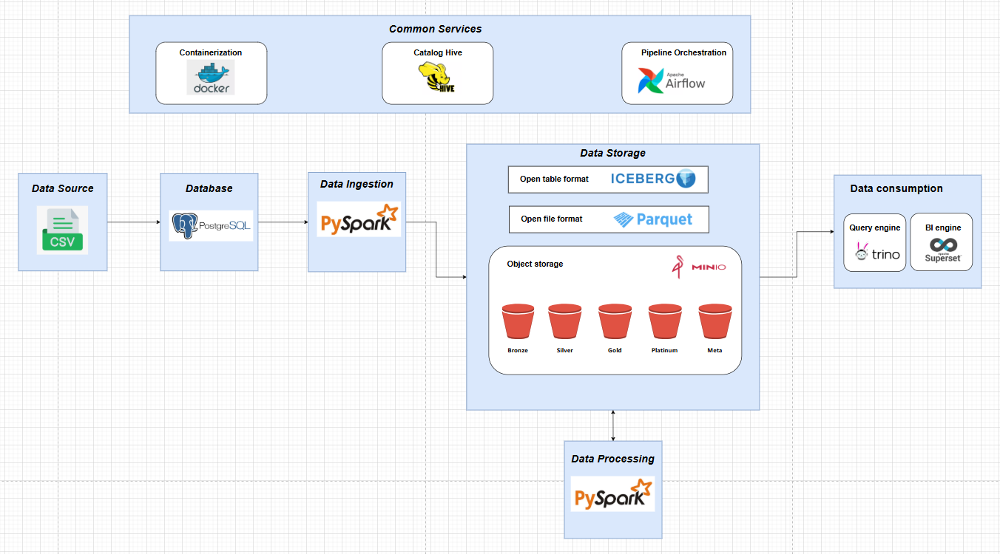
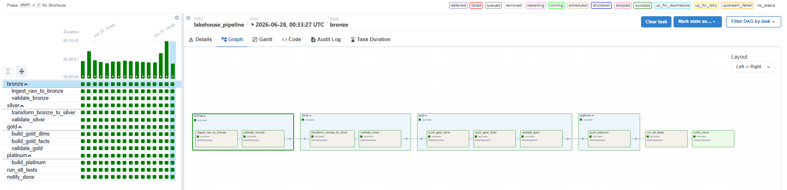
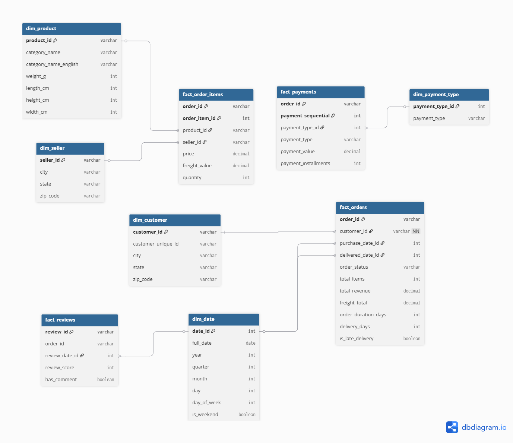
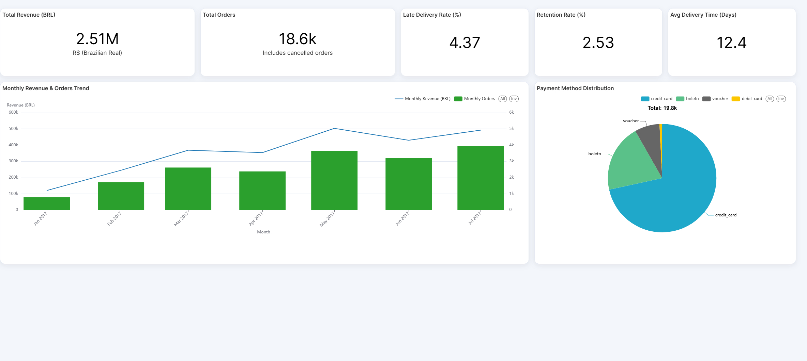
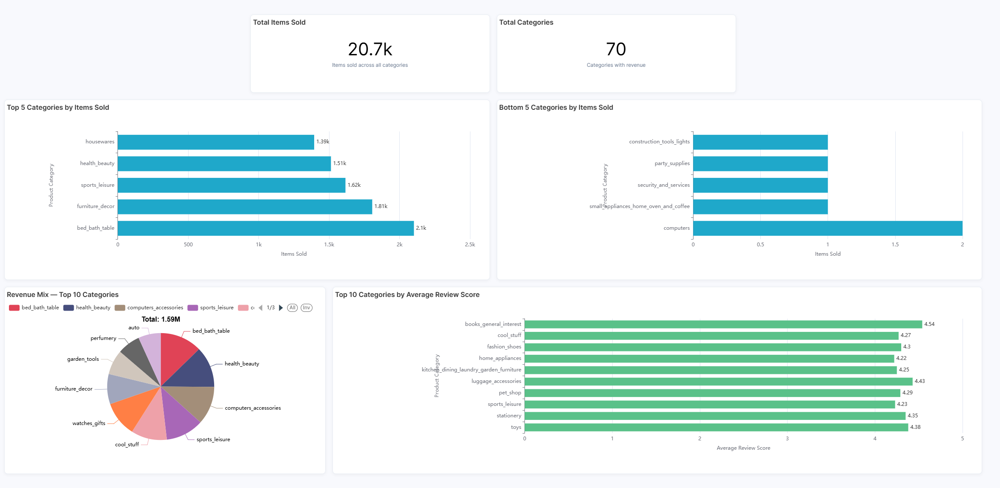
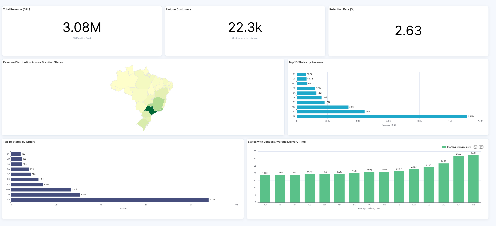
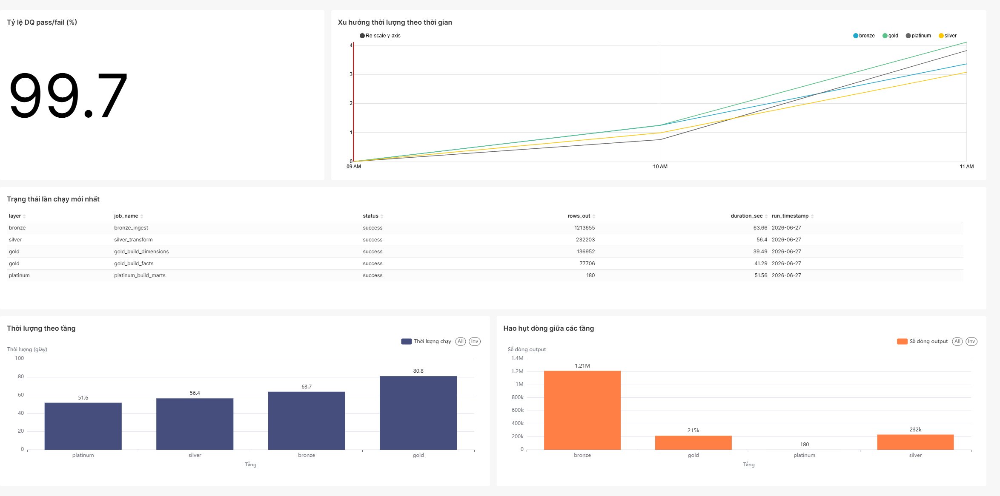
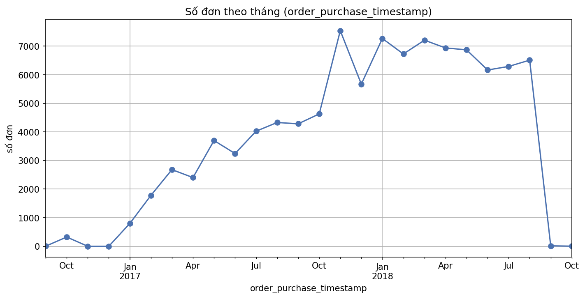
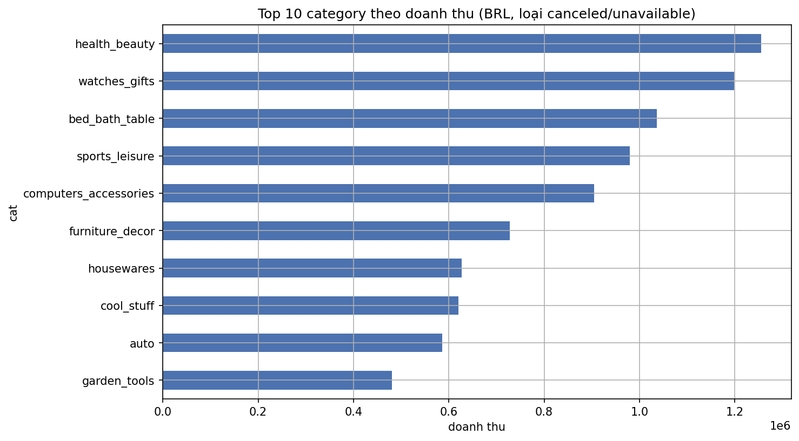
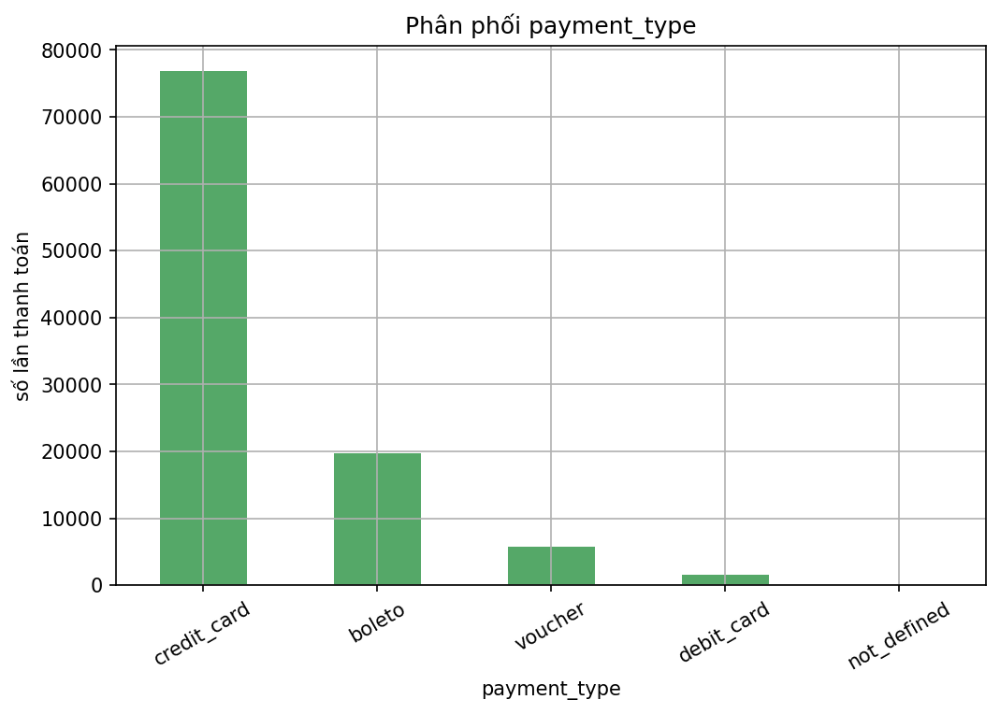

<h1 align="center">🏞️ Olist Mini Lakehouse</h1>

<p align="center">
  <i>Nền tảng dữ liệu Lakehouse thu nhỏ, end-to-end cho phân tích thương mại điện tử Olist (Brazil)</i><br/>
  <sub>Đồ án tốt nghiệp · Trần Duy Tuấn — 2251061917 · Trường Đại học Thủy lợi</sub>
</p>

<p align="center">
  
  
  
  
  
  
  
  
</p>

---

## 📖 Giới thiệu

**Olist Mini Lakehouse** là một nền tảng dữ liệu hoàn chỉnh xây dựng theo kiến trúc
**Lakehouse** và mô hình phân tầng **Medallion**, mô phỏng cách một doanh nghiệp hiện
đại thu thập, xử lý, kiểm soát chất lượng và trực quan hóa dữ liệu — trên bộ dữ liệu
thực tế Brazilian E-Commerce (Olist).

Hệ thống hợp nhất ưu điểm của *Data Warehouse* (giao dịch ACID, mô hình hóa chiều) và
*Data Lake* (lưu trữ đối tượng chi phí thấp, mọi định dạng) thông qua định dạng bảng mở
**Apache Iceberg** trên **MinIO**, xử lý bằng **Apache Spark**, điều phối bằng
**Apache Airflow**, truy vấn bằng **Trino** và trực quan hóa bằng **Apache Superset** —
tất cả đóng gói trong Docker Compose, chạy được cả cục bộ lẫn trên máy chủ đám mây.

## 🏗️ Kiến trúc hệ thống

<p align="center"></p>

```
CSV ─▶ PostgreSQL(olist_source) ─▶ Bronze ─▶ Silver ─▶ Gold ─▶ Platinum ─▶ Superset
                                    └────── Apache Iceberg trên MinIO ──────┘   (qua Trino)
   Airflow điều phối · Hive Metastore (catalog) · khung DQ tự viết (DQ gate) · pytest
```

## 🥇 Mô hình phân tầng Medallion

| Tầng | Vai trò | Mô tả |
|------|---------|-------|
| 🥉 **Bronze** | Dữ liệu thô | Nạp nguyên trạng từ PostgreSQL, giữ lịch sử; `orders` nạp **incremental** theo watermark |
| 🥈 **Silver** | Chuẩn hóa | Làm sạch, ép kiểu, khử trùng lặp; gộp `category_translation` vào `products` → 8 bảng |
| 🥇 **Gold** | Nghiệp vụ | Lược đồ hình sao: 5 bảng chiều + 4 bảng sự kiện; `fact_orders` dùng **MERGE INTO** |
| 💎 **Platinum** | Phục vụ | 7 bảng mart tổng hợp sẵn cho dashboard (doanh thu, giao hàng, đánh giá, retention…) |

## 🧰 Tech stack

Apache Airflow 2.9 · Apache Spark 3.5 (PySpark) · Apache Iceberg 1.5 ·
Hive Metastore 4.0 · MinIO · Trino 440 · Apache Superset 3.1 · PostgreSQL 14 ·
Docker Compose.

## ⚙️ Cài đặt & khởi chạy

**Yêu cầu:** Docker + Docker Compose (24+), RAM ≥ 8 GB. Tải dataset Olist từ Kaggle và
đặt 9 file CSV vào `dataset/`. Sao chép `.env.example` → `.env` và chỉnh mật khẩu.

```bash
docker compose build          # build images (lần đầu hơi lâu)
docker compose up -d          # khởi động 9 services
python scripts/upload_raw_data.py   # (tùy chọn) upload CSV lên MinIO raw bucket
```

| Service | URL (local) | Login mặc định |
|---------|-------------|----------------|
| MinIO Console | http://localhost:9001 | admin / password |
| Airflow | http://localhost:8085 | admin / admin |
| Trino | http://localhost:8090 | (no auth) |
| Superset | http://localhost:8088 | admin / admin |
| Spark Master | http://localhost:8080 | — |

## 🔄 Luồng xử lý (Workflow)

Có **3 DAG** (manual trigger), tách nguồn khỏi pipeline phân tích — pipeline không bao
giờ mutate dữ liệu nguồn:

1. **`seed_source_postgres`** — nạp Olist vào PostgreSQL. Conf `{"mode":"full"}` (đủ 9
   bảng) hoặc `{"mode":"dims_only"}` (chỉ 5 dim, để fact rỗng cho replay).
2. **`simulate_source`** — *(tùy chọn)* phát lại Olist **theo tháng** để demo
   incremental / time-travel / upsert. Conf `{"month":"2017-03","lifecycle":"1"}`.
3. **`lakehouse_pipeline`** — pipeline phân tích, gom task theo tầng medallion:

```
bronze[ingest → validate] → silver[transform → validate]
→ gold[dims → facts → validate] → platinum[marts] → run_etl_tests → notify_done
```

<p align="center"></p>
<!-- TODO: thêm ảnh chụp DAG lakehouse_pipeline chạy thành công vào images/airflow_dag.png -->

## 💾 Chiến lược ghi dữ liệu (Loading Strategy)

| Bảng | Chiến lược | Cơ chế |
|------|-----------|--------|
| `bronze.orders` | **Append** | Incremental theo watermark `source_updated_at`, partition `months(order_purchase_timestamp)` |
| `bronze.{order_items, payments, reviews}` | Overwrite | Tải lại toàn bộ, partition `days(_ingested_at)` |
| `silver.*`, `gold.dim_*`, `platinum.mart_*` | Overwrite | `createOrReplace` mỗi lần chạy → idempotent |
| `gold.fact_orders` | **Upsert** | `MERGE INTO` theo `order_id` (cập nhật tại chỗ, không nhân dòng) |

## ⭐ Mô hình dữ liệu (Star Schema — tầng Gold)

<p align="center"></p>

5 bảng chiều (`dim_customer`, `dim_product`, `dim_seller`, `dim_date`,
`dim_payment_type`) + 4 bảng sự kiện (`fact_orders`, `fact_order_items`,
`fact_reviews`, `fact_payments`). Áp dụng khóa thay thế (surrogate key), chiều suy biến
(degenerate dimension) và xử lý nhân bản (fan-out) bằng `row_number()`.

## ❄️ Tính năng nâng cao của Apache Iceberg

| Snapshot history | Time-travel | MERGE (không nhân dòng) |
|---|---|---|
|  |  |  |

Phân vùng ẩn (hidden partitioning), truy vấn `FOR VERSION AS OF` / `FOR TIMESTAMP AS OF`,
và `MERGE INTO` cho upsert. Chi tiết: [`docs/iceberg_features_demo.md`](docs/iceberg_features_demo.md).

## 📊 Trực quan hóa (Apache Superset)

4 bảng điều khiển kết nối tầng Platinum qua Trino — 3 nghiệp vụ + 1 giám sát vận hành:

| Dashboard | Nội dung |
|-----------|----------|
| **1 · Order & Revenue Overview** | Doanh thu/đơn theo tháng, KPI tổng quan, cơ cấu thanh toán |
| **2 · Product Performance** | Xếp hạng danh mục theo doanh thu, điểm đánh giá theo ngành |
| **3 · Sales by Geography** | Doanh thu/khách theo bang, bản đồ Brazil, thời gian giao |
| **4 · Pipeline Observability (Ops)** | `job_log`/`dq_results`: trạng thái, thời lượng, hao hụt dòng, tỉ lệ DQ |

<p align="center">
  
  <br/>
  
  
</p>

## 🔍 Phân tích khám phá (EDA)

`notebooks/eda_olist.ipynb` đọc trực tiếp `dataset/*.csv` (read-only) — profiling null,
phân phối, insight nghiệp vụ. Xuất biểu đồ ra `notebooks/figures/`.

<p align="center">
  
  
  
</p>

## ☁️ Triển khai trên đám mây

Hệ thống đã được triển khai và kiểm chứng thực tế trên **DigitalOcean Droplet**
(4 vCPU · 8 GB RAM · SSD 160 GB · Ubuntu 24.04 LTS · Singapore) ở chế độ **single-node**
bằng cùng một lệnh `docker compose up -d`. Các giao diện đưa ra ngoài qua **Nginx reverse
proxy + HTTPS (Let's Encrypt)**; dashboard Superset có thể mở công khai để trình diễn.

### 🔗 Demo trực tuyến

Các bảng điều khiển Apache Superset (công khai — không cần đăng nhập):

| Dashboard | Link |
|-----------|------|
| Order & Revenue Overview | https://lake-house.tech/superset/dashboard/1/ |
| Product Performance | https://lake-house.tech/superset/dashboard/2/ |
| Sales by Geography & Customer | https://lake-house.tech/superset/dashboard/3/ |
| Pipeline Observability (Ops) | https://lake-house.tech/superset/dashboard/4/ |

> Các giao diện quản trị (Airflow, MinIO, Trino, Spark UI) được bảo vệ bằng tài khoản
> riêng và chỉ mở khi trình diễn; thông tin truy cập được cung cấp riêng cho hội đồng,
> không công khai vì lý do an toàn.

## 📁 Cấu trúc thư mục

```
├── docker-compose.yml      # 9 services
├── docker/                 # images & config (airflow, spark, hive, postgres, trino, superset)
├── pipeline/               # ETL theo tầng
│   ├── common/             # config, spark_session, data_quality, job_log
│   ├── bronze/ silver/ gold/ platinum/
├── dags/                   # lakehouse_pipeline, seed_source_postgres, simulate_source
├── tests/                  # pytest (bronze/silver/gold)
├── notebooks/              # eda_olist.ipynb + figures/
├── scripts/                # init buckets, upload raw, iceberg_demo.sql
├── docs/                   # iceberg_features_demo.md + images/
├── Tài liệu/               # tài liệu thiết kế (DESIGN, kiến trúc, trạng thái dữ liệu)
└── dataset/                # 9 CSV Olist
```

## 🏆 Kết quả tiêu biểu (kịch bản nạp đầy đủ)

| Tầng | Quy mô | | Chỉ số nghiệp vụ | Giá trị |
|------|--------|---|------------------|---------|
| Bronze | ~1,55 triệu dòng (9 bảng) | | Tổng doanh thu | ~R$ 13,49 triệu / 24 tháng |
| Silver | 8 bảng | | Bang dẫn đầu | São Paulo (~38%) |
| Gold | 5 dim + 4 fact (99.441 đơn) | | Thanh toán chủ đạo | credit_card (~77%) |
| Platinum | 7 mart | | Kiểm thử / hiệu năng | 19/19 pytest · ~257 giây |

---

<p align="center"><sub>Apache Iceberg · Spark · Airflow · Trino · MinIO · Superset — © 2026 Trần Duy Tuấn</sub></p>
