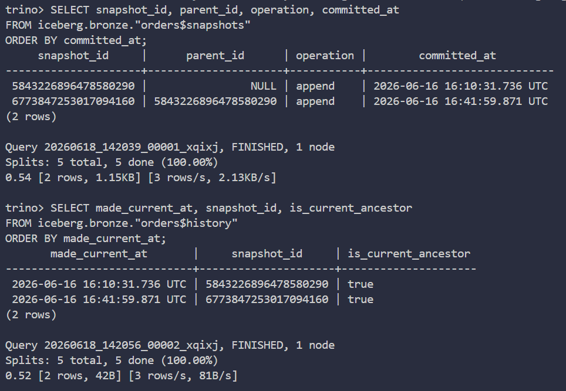
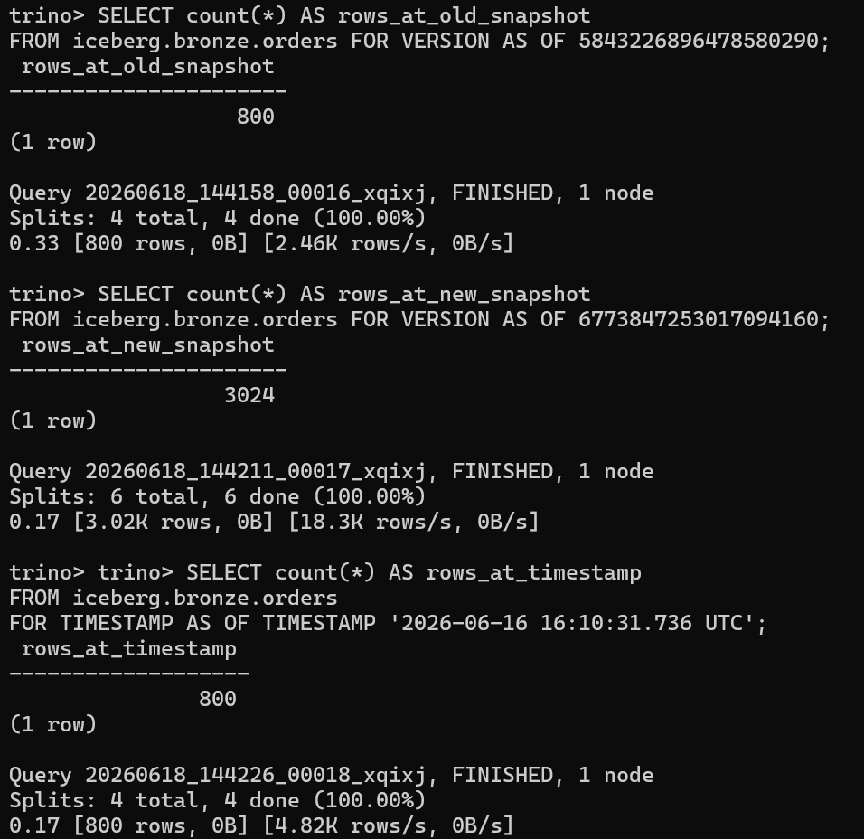
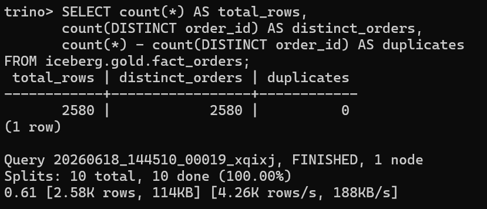
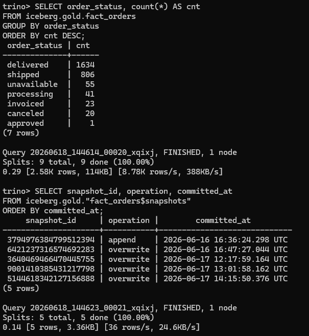

# Iceberg Features Demo — Snapshot, Time-travel & MERGE INTO

Tài liệu này dùng để demo **vì sao dự án chọn Apache Iceberg** thay vì chỉ lưu
Parquet thuần: Iceberg có metadata snapshot, đọc lại dữ liệu quá khứ bằng
time-travel, và hỗ trợ upsert/CDC bằng `MERGE INTO`.

Các truy vấn chạy bằng **Trino** trên catalog `iceberg`. File SQL đi kèm:
[`scripts/iceberg_demo.sql`](../scripts/iceberg_demo.sql).

## 0. Cách chạy

Mở Trino CLI:

```bash
docker compose exec -T trino trino --catalog iceberg
# Sử dụng đúng tại local:
docker compose exec -T trino trino --server 127.0.0.1:8080 --catalog iceberg
```

Nếu muốn chạy file SQL mẫu:

```bash
docker compose cp scripts/iceberg_demo.sql trino:/tmp/iceberg_demo.sql
docker compose exec -T trino trino --catalog iceberg -f /tmp/iceberg_demo.
# Sử dụng đúng tại local:
docker compose cp scripts/iceberg_demo.sql trino:/tmp/iceberg_demo.sql
docker compose exec -T trino trino --server 127.0.0.1:8080 --catalog iceberg -f /tmp/iceberg_demo.sql

```

Lưu ý: file `scripts/iceberg_demo.sql` chỉ chứa các truy vấn **chạy thẳng được**.
Riêng phần `FOR VERSION AS OF` phải copy `snapshot_id` từ kết quả mục 1 rồi chạy
thủ công, vì Trino không cho thay động snapshot id trong cùng một câu SQL đơn giản.

Bảng demo chính:

- `iceberg.bronze.orders`: bảng incremental append, sinh nhiều snapshot khi replay.
- `iceberg.gold.fact_orders`: bảng fact dùng `MERGE INTO` ở pipeline Gold.

## 1. Snapshot history — mỗi lần ghi tạo một phiên bản mới

Iceberg lưu metadata cho từng lần ghi. Với bảng `bronze.orders`, mỗi lần ingest
hoặc replay thêm tháng mới sẽ tạo snapshot mới. Hai metadata table quan trọng là
`orders$snapshots` và `orders$history`.

```sql
SELECT snapshot_id, parent_id, operation, committed_at
FROM iceberg.bronze."orders$snapshots"
ORDER BY committed_at;
```

```sql
SELECT made_current_at, snapshot_id, is_current_ancestor
FROM iceberg.bronze."orders$history"
ORDER BY made_current_at;
```

Kết quả mong đợi:

- Có nhiều dòng snapshot.
- `committed_at` tăng dần theo các lần chạy pipeline/replay.
- `operation` thường có `append`, `overwrite`, hoặc các operation liên quan đến rewrite/MERGE.

Ảnh cần chụp: kết quả 2 câu trên trong Trino CLI hoặc Trino Web UI.

Lưu vào:

```text
docs/images/iceberg/01_snapshots.png
```



## 2. Time-travel — đọc lại trạng thái quá khứ

Đầu tiên lấy snapshot cũ và snapshot mới:

```sql
-- Snapshot cũ: lấy một snapshot đầu tiên
SELECT snapshot_id, committed_at, operation
FROM iceberg.bronze."orders$snapshots"
ORDER BY committed_at
LIMIT 5;

-- Snapshot mới: lấy snapshot gần nhất
SELECT snapshot_id, committed_at, operation
FROM iceberg.bronze."orders$snapshots"
ORDER BY committed_at DESC
LIMIT 5;
```

Sau đó copy 2 giá trị `snapshot_id` vào 2 câu dưới đây. Ví dụ nếu snapshot id là
`123456789`, viết trực tiếp số đó, không dùng dấu `< >`.

```sql
-- Thay 123456789 bằng snapshot_id cũ
SELECT count(*) AS rows_at_old_snapshot
FROM iceberg.bronze.orders FOR VERSION AS OF 123456789;

-- Thay 987654321 bằng snapshot_id mới
SELECT count(*) AS rows_at_new_snapshot
FROM iceberg.bronze.orders FOR VERSION AS OF 987654321;
```

Kết quả mong đợi: số dòng ở snapshot mới lớn hơn snapshot cũ nếu bạn đã replay
nhiều tháng. Đây là bằng chứng rõ nhất cho khả năng audit/debug dữ liệu quá khứ.

Có thể demo time-travel theo mốc thời gian bằng cách lấy một `committed_at` từ
`orders$snapshots`, rồi thay vào:

```sql
SELECT count(*) AS rows_at_timestamp
FROM iceberg.bronze.orders
FOR TIMESTAMP AS OF TIMESTAMP '2026-06-18 00:00:00 UTC';
```

Ảnh cần chụp: 2 kết quả `count(*)` khác nhau ở 2 snapshot.

Lưu vào:

```text
docs/images/iceberg/02_time_travel.png
```



## 3. MERGE INTO — upsert vòng đời đơn hàng

Trong pipeline, `gold.fact_orders` được build bằng `MERGE INTO` trong Spark:

```sql
MERGE INTO gold.fact_orders t
USING _fact_orders_src s ON t.order_id = s.order_id
WHEN MATCHED THEN UPDATE SET *
WHEN NOT MATCHED THEN INSERT *
```

Ý nghĩa: khi một order đổi trạng thái, ví dụ `shipped` thành `delivered`, Gold
cập nhật bản ghi theo `order_id` thay vì sinh thêm dòng trùng khóa.

Kiểm chứng không trùng `order_id`:

```sql
SELECT count(*) AS total_rows,
       count(DISTINCT order_id) AS distinct_orders,
       count(*) - count(DISTINCT order_id) AS duplicates
FROM iceberg.gold.fact_orders;
```

Kết quả mong đợi:

```text
duplicates = 0
```

Kiểm tra phân bố trạng thái sau khi lifecycle update được merge vào Gold:

```sql
SELECT order_status, count(*) AS cnt
FROM iceberg.gold.fact_orders
GROUP BY order_status
ORDER BY cnt DESC;
```

Kiểm tra snapshot của bảng Gold sau các lần MERGE:

```sql
SELECT snapshot_id, operation, committed_at
FROM iceberg.gold."fact_orders$snapshots"
ORDER BY committed_at;
```

Ảnh cần chụp:

```text
docs/images/iceberg/03a_merge_no_dup.png
docs/images/iceberg/03b_status_after_merge.png
```




## 4. Data files — xem layout vật lý của bảng

Iceberg cũng cho xem metadata file dữ liệu qua table `$files`:

```sql
SELECT file_path, record_count, file_size_in_bytes
FROM iceberg.bronze."orders$files"
ORDER BY record_count DESC
LIMIT 20;
```

Điểm này dùng để giải thích rằng Iceberg không chỉ là dữ liệu, mà còn có metadata
quản lý file/snapshot để query engine như Trino đọc hiệu quả hơn.

## 5. Tóm tắt để đưa vào báo cáo

| Tính năng        | Câu lệnh minh hoạ                          | Ý nghĩa trong đồ án                  |
| ---------------- | ------------------------------------------ | ------------------------------------ |
| Snapshot history | `orders$snapshots`, `orders$history`       | Audit, kiểm tra lịch sử ghi dữ liệu  |
| Time-travel      | `FOR VERSION AS OF`, `FOR TIMESTAMP AS OF` | Đọc lại dữ liệu tại một phiên bản cũ |
| MERGE INTO       | `WHEN MATCHED/NOT MATCHED`                 | Upsert CDC, tránh trùng `order_id`   |
| Metadata files   | `orders$files`                             | Quan sát layout file vật lý của bảng |

Khi bảo vệ, nên demo theo thứ tự:

1. Mở `orders$snapshots` để cho thấy bảng có nhiều phiên bản.
2. Chạy `FOR VERSION AS OF` với 2 snapshot khác nhau để thấy row count khác nhau.
3. Chạy query `duplicates = 0` trên `gold.fact_orders` để chứng minh MERGE không làm trùng khóa.
4. Mở ảnh hoặc Superset/Trino Web UI để hội đồng thấy kết quả trực quan.

## 6. Checklist ảnh cần chụp

Đặt screenshot vào `docs/images/iceberg/`, sau đó bỏ comment các dòng `![...]`
tương ứng trong tài liệu này.

| File ảnh                     | Nội dung                                       |
| ---------------------------- | ---------------------------------------------- |
| `01_snapshots.png`           | Kết quả `orders$snapshots` và `orders$history` |
| `02_time_travel.png`         | Row count khác nhau giữa 2 snapshot            |
| `03a_merge_no_dup.png`       | Query `duplicates = 0`                         |
| `03b_status_after_merge.png` | Phân bố `order_status` sau MERGE               |
